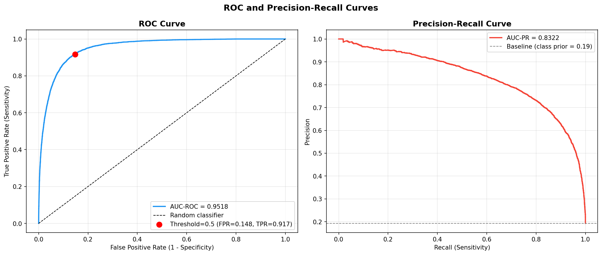
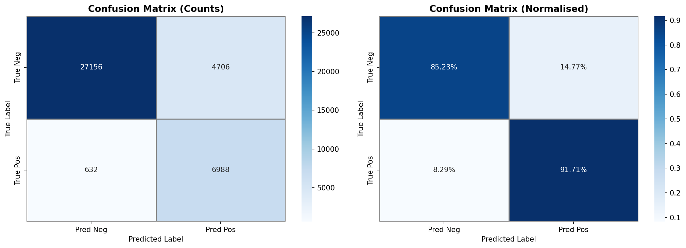
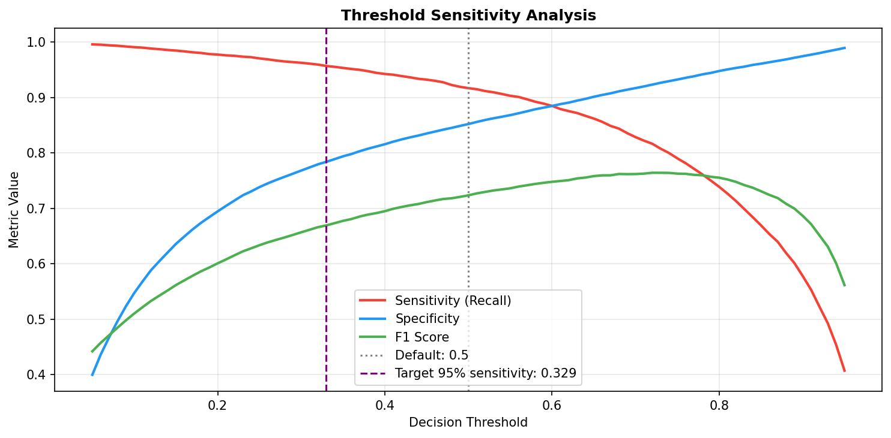
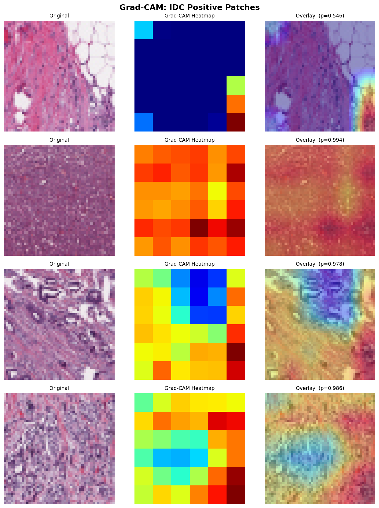

# Invasive Ductal Carcinoma CNN Image Classifier

## Overview
This is a Convolutional Neural Network intended to classify 50x50 pixel histopathological patches from breast tissue 
slides as positive for Invasive Ductal Carcinoma (IDC) (1) or IDC-negative (0). The project covers an extensive 
evaluation process that covers threshold selection, probability calibration and Grad-CAM visualisations to understand
the model's behaviour. Intended for research purposes, not clinical use.

## Key Demonstrations in Project

* A comprehensive pipeline from raw image patches to a fully-trained and exportable model.
* Training on a large, imbalanced medical imaging dataset containing:
    - 277 524 image patches of size 50x50 pixels from 279 individual patients
    - Patient-level train (70%), validation (15%) and test (15%) splitting strategy to prevent data leakage
    - A negative to positive class imbalance ratio of about 2.5:1 handled by applying class weights
* A custom-designed CNN suitable to 50x50 inputs on which using a large ImageNet architecture would be overengineering 
a solution which will in turn diminish performance by overfitting:
  - 4 blocks of 3x3 convolutions (32,64,128,256 filters) with each convolution followed by batch normalisation and ReLU 
activation combined with max pooling between blocks
  - `GlobalAveragePooling2D` is followed by a 256 -> 128 -> 1 dense head and sigmoid output
  - Generalisation reinforced through regularisation techniques: spatial dropout, L2 and AdamW weight decay
  - Normalisation layer fitted on training data with augmentations built into the model graph
  - Total of about 1.28M parameters
* Mixed precision training containing custom layers - `CastToFloat32`, `CastToFloat16`- with a custom `BinaryF1Score` 
metric
* Evaluation beyond just accuracy including:
  - AUC-ROC and precision-recall curves
  - Threshold analysis
  - Probability calibration

## Setup

Requires **Python 3.10** or **3.11** and **TensorFlow 2.17.0** for compatibility with a WSL2 Ubuntu environment. 
TensorFlow versions above **2.10** don't support GPU on native Windows and training on CPU would take too long.
Recommended to use GPU acceleration for this reason.

**Note:** 
* Adjust `BATCH_SIZE` value dependent on your VRAM constraints 
* Ensure that you run this project on a CUDA-compatible GPU

### Using `bash`
```bash
conda create -n <env_name> python=3.11 -y   # Can use 3.10 too
conda activate <env_name>
cd "/mnt/path/to/project"
pip install -r requirements.txt
nvidia-smi  
jupyter notebook
```

## Dataset
277 524 histopathological image patches:
* IDC-Negative (0) = 198 738
* IDC-Positive (1) = 78 786

Patches are stored by patient with the patient ID extracted by parsing each filename.
Patients are then shuffled and split with their respective patches into a 70%, 15% and 15% training, validation and 
testing grouping.

| Split      | No. patches | Positive Rate (%) |
|------------|-------------|-------------------|
| Train      | 201 231     | 29.8              |
| Validation | 36 811      | 30.2              |
| Test       | 39 482      | 19.3              |

Split is unstratified, producing a discrepancy between the IDC-positive sample prevalence in both 
the Test and Train splits. Took this into consideration when evaluating the **AUC-PR** 
metric.

Link to dataset: https://www.kaggle.com/datasets/paultimothymooney/breast-histopathology-images

## Model

50x50px raw image patches scaled to [0,1] (input) → `CastToFloat32` → Augment → `CastToFloat32` → Normalisation → 
`CastToFloat16` → 4x Conv Blocks → Output layer

**Note:** If you are reloading the model outside the notebook for any reason, register all custom layers as custom 
objects.

## Training

* Optimiser: AdamW, learning rate 3e-4, weight decay 1e-4
* Loss: Binary cross-entropy with class weights
* Batch size: 32 (tune to suit whatever VRAM capacity you possess)
* Max 50 epochs
* `EarlyStopping` based on `val_auc`, where patience = 8 and best weights are stored. `ReduceLROnPlateau` and 
`ModelCheckpoint` are both based on `val_auc`
* Easier to interpret `val_auc` hence it's monitored over loss
* Class weights stopped epoch 33 (best + patience=8), Epoch 25 was restored.

## Evaluation

Further analysis and examination of those patches will give a good view into further evaluating model performance.

### Test set metrics

The test-set that was held out yielded these results:

| Metric           | Threshold (0.5) | Threshold (0.3294) |
|------------------|-----------------|--------------------|
| Accuracy         | 0.8648          | 0.8173             |
| Precision (IDC+) | 0.5976          | 0.5144             |
| Recall (IDC+)    | 0.9171          | 0.9572             |
| F1 (IDC+)        | 0.7236          | 0.6691             |

* **AUC-ROC**: 0.9518
  * Indicates the discriminability of the classifier, the goal was >0.90. Score is more than satisfactory.
* **AUC-PR**: 0.8322 , baseline of 0.19
  * Dependent on prevalence and test set had a low (~19%) positive rate but plot remained high above the baseline
    (0.19), showing that it's not exploiting the imbalance bur rather discriminating genuinely.
* **Threshold Analysis**: In the clinical context at hand, False Negatives are fatal errors and significantly more 
consequential than a false alarm, which comes at the cost of unnecessary expenditure and stress. With this in mind, 
targeting a lower threshold (the point that coincides with ~95% sensitivity) to sacrifice precision for a drop in false 
negatives is a trade-off I can live with in this solution. **Youden J Statistic** was only computed for demonstration 
purposes.
* **Probability calibration** to test whether the confidence is trustworthy and not just the ranking.
* Precision depends on how common IDC-positive patches are, and the test set is only 19.3% positive.



<p align="center">


### Grad-CAM Visualisation

Generated and applied Grad-CAM heatmaps and overlays to visualise spatial regions the model used
to classify the patches in positive patches.

<p align="center">

</p>

**False Negative Analysis**:
Patches are cut ups not full slide samples
* Samples that fall at tumor region boundaries are difficult to classify
* Low cellularity in a sample can also affect classification

These are likely explanations.

## Project structure 

```
IDC_CNN_Classifier.ipynb    #Main notebook
requirements.txt
patient_split.json          #For a more direct comparison in model performance, this ensures the split is identical
checkpoints/                #Contains best weight saved during training
logs/                       #Training logs in a CSV format
models/                      #Model saved in various formats
    idc_cnn_savedmodelV2/
    idc_cnn_finalV2.h5
    idc_cnn_finalV2.keras
images/                     #Plots and visualisations from the pipeline
```

## Known Limitations

* Should not be used as a diagnostic tool, intended for research purposes
* Low-resolution input patches presents a notable constraint
* Only moderately precise on positive patches in exchange for high recall
  * For its purpose it's a problem one can live with as type I errors are typically not fatal
* Classification happens at patch level not whole-slide image analysis
* Trained on a single dataset from 279 patients, so generalisation to other scanners, staining protocols or
institutions is untested
* Model performance is reported off a single training when ideally the average of 2-5 training runs would be more
informative.